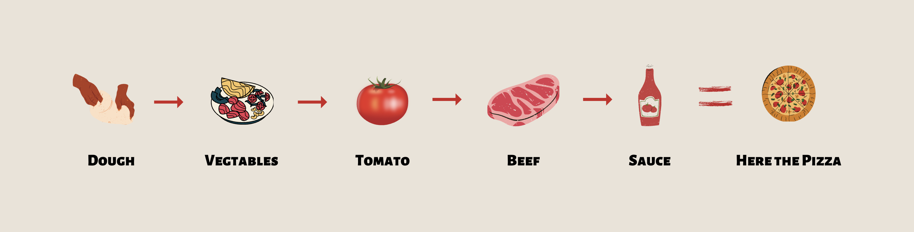

# Decorator: Wrapper of an object

Decorator pattern lets you dynamically change the behavior of an object at run time by wrapping them in an object of a decorator class.

Wikipedia Says
-------
In OOP, The decorator pattern is a design pattern that allows behaviour to be added to an individual object, Either statically or dynamically, Without affecting the behaviour of other objects from the same class. The decorator is often useful for adhering to the SRP, as it allows functionality to be divided between classes with unique areas of concern.

⬇️ Let me describe with an example
------

Imagine you have a restaurant and want to create a menu for customers.
Let's explain it by pizza menu, There are five different pizza which is on the menu.
If we do not use a decorator-pattern to create an order, We have to create five different pizza classes and use that for getting customer orders. It works and you can get some orders from the customers,
But imagine someone wants to change the order a little bit. 
For example, adding some extra sauce, add some vegetables, and mix some different cheese.
You can't do it, because in run-time you can't add those items to your program.
If you want to create this order you need to create the new pizza item in the menu, which is not usable for other customers.

Let's use the decorator pattern in the program and see how it will work.
Instead of creating static pizza item's, you will create them dynamically at runtime.

For example, a normal pizza contains dough, some cheese, some sauce, vegetables, beef, tomato, and pepperoni 
Whenever a customer wants to create a specific one, You can easily do it like below
  
- Put a dough on table  
- add some vegetables  
- add a slice of tomato  
- add some beef  
- add french sauce    
  
Then you will create the order easily at runtime without creating a new item in your menu.

You can clone the source code and try to test it in action.

Applicability
-------
- Add responsibility to individual objects dynamically and transparently, that is, without affecting other objects.  
- For responsibilities that  can be withdrawn.
- When extension by subclassing is impractical. Sometimes a large number if independent extensions are possible and would produce an explosion of subclasses to support every combination. Or a class definition maybe hidden or otherwise unavailable for subclassing.

Sponsor
-------
### If you like and use it, please tap the Star(⭐️) button at the above.  
This source code is free for all; hence, it's not profitable. You can make me happy by donating me :)

License
-------
Copyright (C) 2020 Mehdi Janbarari  
The source code can be used according to the [Apache License, Version 2.0](LICENSE).